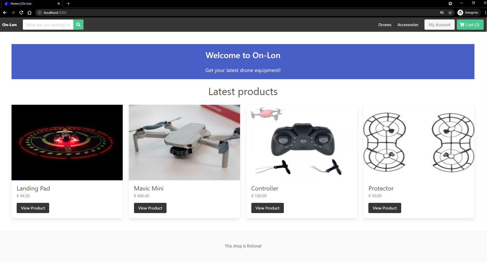

# On-Lon

A fictional drone online-shop.

The name refers to the Bavarian term for "ein Laden" - "a store".

:eyes: Images can be found in /sample-images

Vue.js is used for the frontend, Django for the backend.

Payment uses the Stripe API.

:warning:

- Please do not enter personal information or real credit card information
  - Recommended: 4242 4242 4242 4242 'month/yearInTheFuture' 123
- A .env file holds the necessary Django and Stripe secret key, as well as the debug mode variable

## Commands

Tested on Windows 10:

create environment

```
python -m virtualenv environment_3_9_5
```

Activate environment

```
.\pathToEnvironmentDir\Scripts\activate
```

For changes to database structure

```
python manage.py makemigrations
python manage.py migrate
```

Run backend

```
python manage.py runserver
```

Start web view (localhost:8080)

```
npm run serve
```

Django admin view
http://localhost:8000/admin/

admin@on-lon.com
